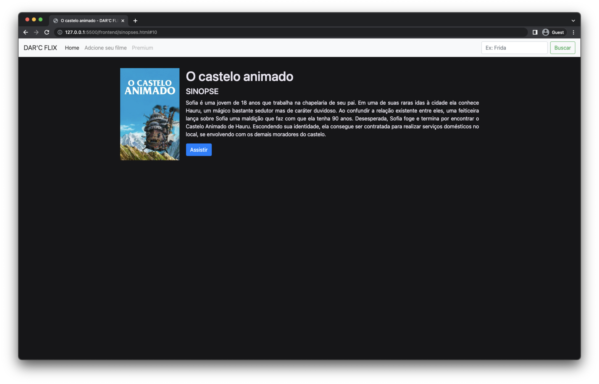
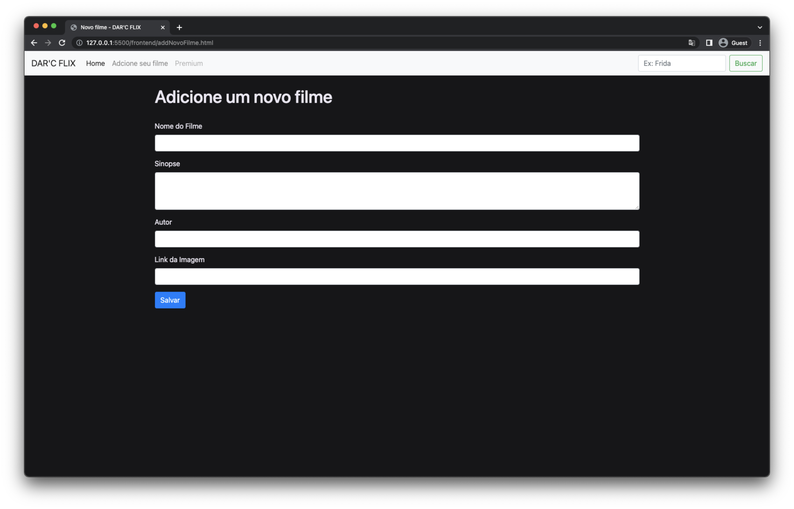

<h1 align="center">DAR'C FLIX</h1>

Desenvolvimento de uma mini plataforma colaborativa de catálogo de filmes. 📖 📚 📱

---

 

  <a href="#demonstracao">Demonstração</a> •
  <a href="#features">Features</a> •
  <a href="#pre-requisitos">Pré-Requisitos</a> •
  <a href="#rodando-projeto">Rodando o Projeto</a> •
  <a href="#tecnologias">Tecnologias</a> •
  <a href="#autor">Autora</a>

---

<h2 id="demonstracao">📽️ Demonstração</h2>

  
  
  
  

---

<h2 id="features">🚀 Features</h2>

- [x] Tela de home onde é apresentado os filmes e um botão para cadastro de novos filmes;
- [x] Ao clicar em um filme a aplicação será direcionada para a pagina de sinopse;
- [x] Permite o usuário adcionar um novo filme.

---

<h2 id="pre-requisitos">⚙️ Pré-requisitos</h2>
Para começar, você precisa ter instalado as seguintes ferramentas:

- [Git](https://git-scm.com)
- [Visual Studio Code](https://code.visualstudio.com/)
- [NodeJS](https://nodejs.org/en)

---

<h2 id="rodando-projeto"> 🧑‍💻 Rodando o projeto</h2>
Para rodar o projeto é só seguir os seguintes passos:

1. Você deve estar conectado no PC;</li>
2. Clone o repositório: `git clone https://github.com/DarcPabla/darcflix.git`
3. Inicie o backend
   1. Entre na pasta: `cd backend`
   2. Instale as dependências: `npm install`
   3. Execute a aplicação: `npm start`
4. Inicie o frontend
   1. Clicar no arquivo index.html com a parte direita do mouse, e depois clicar na opção "Open with Lite Server".

---

<h2 id="tecnologias"> 🤖 Tecnologias</h2>

As seguintes tecnologias foram usadas nesse projeto:

- [HTML](https://developer.mozilla.org/pt-BR/docs/Web/HTML)
- [Node Js](https://nodejs.org/en/)
- [CSS](https://developer.mozilla.org/pt-BR/docs/Web/CSS)
- [JavaScript](https://developer.mozilla.org/pt-BR/docs/Web/JavaScript)
- [Bootstrap](https://getbootstrap.com/)

---

<h2 id="autor">👨 Autora</h2>

<a href="https://github.com/DarcPabla">
 
  
 <b>Darc Pabla</b>
</a>
  
